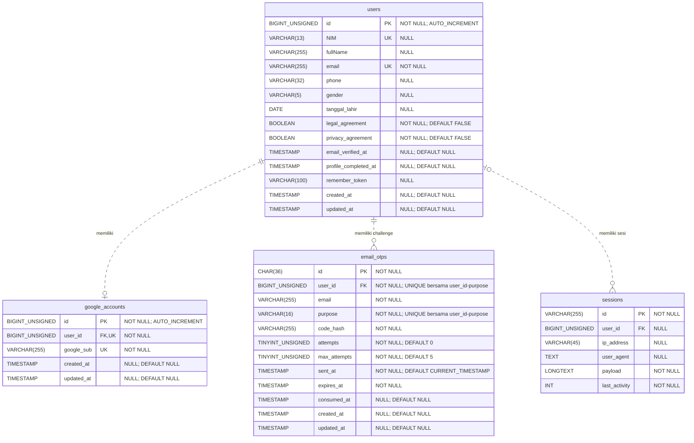

# ERD awal SIKAGIG

Acuan: [sikagig.sql](../../../apps/api/database/sikagig.sql). Target MySQL 8.0.16+ dengan CHECK aktif, engine InnoDB, charset `utf8mb4`, dan collation `utf8mb4_unicode_ci` kecuali kolom yang memakai `ascii_bin`.

Skema awal ini mencakup autentikasi email + OTP, akun Google, profil pengguna, dan sesi. Seluruh entitas dan nama kolom di bawah mengikuti SQL, termasuk kapitalisasi `NIM` dan `fullName`.

Diagram editable: [ERD draw.io](erd.xml) dan [database fisik draw.io](../physical-database/physical-database.xml). Buka berkas XML melalui menu impor draw.io.

## Diagram relasi

PK = primary key, FK = foreign key, UK = unique key satu kolom. `UNSIGNED` ditulis dengan garis bawah dalam tipe Mermaid. Garis putus-putus menunjukkan relasi non-identifying: FK tidak menjadi bagian PK tabel anak.

## Kardinalitas dan penghapusan

| Relasi | Anak per pengguna | Pengguna per anak | ON DELETE |
| --- | --- | --- | --- |
| users -> google_accounts | 0..1 | Tepat 1 | CASCADE |
| users -> email_otps | 0..N; dibatasi satu baris per purpose | Tepat 1 | CASCADE |
| users -> sessions | 0..N | 0..1; user_id boleh NULL | CASCADE |

`google_accounts.user_id` bersifat UNIQUE. Pada `email_otps`, UNIQUE berlaku pada pasangan `(user_id, purpose)`, bukan masing-masing kolom. Karena purpose dibatasi ke login/register, satu pengguna dapat memiliki maksimal dua baris challenge. Komentar SQL menetapkan resend mengganti UUID dan hash pada slot yang sama; perilaku resend dijalankan aplikasi.

Menghapus pengguna menghapus akun Google, challenge OTP, dan sesi yang merujuk kepadanya. Sesi dengan `user_id = NULL` tidak merujuk pengguna. SQL tidak menetapkan aksi ON UPDATE secara eksplisit.

## Kamus kolom

Kolom Default berisi `-` jika SQL tidak menuliskan DEFAULT eksplisit. Timestamp nullable tidak memiliki ON UPDATE otomatis dalam SQL.

### users

| Kolom | Tipe SQL | NULL | Kunci | Default | Keterangan |
| --- | --- | --- | --- | --- | --- |
| `id` | `BIGINT UNSIGNED` | Tidak | PK | - | Identitas pengguna; AUTO_INCREMENT. |
| `NIM` | `VARCHAR(13)` | Ya | UK | - | Unik jika terisi; tepat 13 digit, termasuk nol di depan. |
| `fullName` | `VARCHAR(255)` | Ya | - | - | Nama lengkap; boleh NULL selama profil belum lengkap. |
| `email` | `VARCHAR(255)` | Tidak | UK | - | Unik dan tidak boleh kosong setelah TRIM. |
| `phone` | `VARCHAR(32)` | Ya | - | - | String agar nol awal tetap tersimpan; validasi format dilakukan aplikasi. |
| `gender` | `VARCHAR(5)` | Ya | - | - | man atau woman; ascii/ascii_bin. |
| `tanggal_lahir` | `DATE` | Ya | - | - | Tanggal lahir; input DD/MM/YYYY dikonversi aplikasi menjadi YYYY-MM-DD. |
| `legal_agreement` | `BOOLEAN` | Tidak | - | `FALSE` | 1 = setuju; 0 = belum setuju. CHECK membatasi nilai ke 0/1. |
| `privacy_agreement` | `BOOLEAN` | Tidak | - | `FALSE` | 1 = setuju; 0 = belum setuju. CHECK membatasi nilai ke 0/1. |
| `email_verified_at` | `TIMESTAMP` | Ya | - | `NULL` | Waktu verifikasi email. |
| `profile_completed_at` | `TIMESTAMP` | Ya | - | `NULL` | Jika terisi, CHECK mewajibkan kelengkapan profil dan persetujuan. |
| `remember_token` | `VARCHAR(100)` | Ya | - | - | Token remember-me. |
| `created_at` | `TIMESTAMP` | Ya | - | `NULL` | Waktu pembuatan. |
| `updated_at` | `TIMESTAMP` | Ya | - | `NULL` | Waktu pembaruan. |

### google_accounts

| Kolom | Tipe SQL | NULL | Kunci | Default | Keterangan |
| --- | --- | --- | --- | --- | --- |
| `id` | `BIGINT UNSIGNED` | Tidak | PK | - | AUTO_INCREMENT. |
| `user_id` | `BIGINT UNSIGNED` | Tidak | FK, UK | - | FK ke users.id dan unik: maksimal satu akun Google per pengguna. |
| `google_sub` | `VARCHAR(255)` | Tidak | UK | - | Identitas sub Google; unik, tidak kosong; ascii/ascii_bin. Verifikasi token dilakukan backend. |
| `created_at` | `TIMESTAMP` | Ya | - | `NULL` | Waktu pembuatan. |
| `updated_at` | `TIMESTAMP` | Ya | - | `NULL` | Waktu pembaruan. |

### email_otps

| Kolom | Tipe SQL | NULL | Kunci | Default | Keterangan |
| --- | --- | --- | --- | --- | --- |
| `id` | `CHAR(36)` | Tidak | PK | - | UUID challenge menurut komentar SQL; bukan kode OTP. ascii/ascii_bin; format UUID tidak diperiksa CHECK. |
| `user_id` | `BIGINT UNSIGNED` | Tidak | FK | - | FK ke users.id; bagian UNIQUE gabungan (user_id, purpose). |
| `email` | `VARCHAR(255)` | Tidak | - | - | Email tujuan saat pengiriman; bukan FK ke users.email. |
| `purpose` | `VARCHAR(16)` | Tidak | - | - | login atau register; bagian UNIQUE gabungan (user_id, purpose). |
| `code_hash` | `VARCHAR(255)` | Tidak | - | - | Hash OTP; kode asli 4 digit ditangani aplikasi, panjangnya tidak diperiksa SQL. |
| `attempts` | `TINYINT UNSIGNED` | Tidak | - | `0` | Jumlah percobaan; tidak boleh melebihi max_attempts. |
| `max_attempts` | `TINYINT UNSIGNED` | Tidak | - | `5` | Batas percobaan antara 1 dan 10. |
| `sent_at` | `TIMESTAMP` | Tidak | - | `CURRENT_TIMESTAMP` | Waktu pengiriman. |
| `expires_at` | `TIMESTAMP` | Tidak | - | - | Harus lebih besar dari sent_at. |
| `consumed_at` | `TIMESTAMP` | Ya | - | `NULL` | Waktu challenge digunakan; boleh NULL. |
| `created_at` | `TIMESTAMP` | Ya | - | `NULL` | Waktu pembuatan. |
| `updated_at` | `TIMESTAMP` | Ya | - | `NULL` | Waktu pembaruan. |

### sessions

| Kolom | Tipe SQL | NULL | Kunci | Default | Keterangan |
| --- | --- | --- | --- | --- | --- |
| `id` | `VARCHAR(255)` | Tidak | PK | - | Identitas sesi. |
| `user_id` | `BIGINT UNSIGNED` | Ya | FK | - | FK ke users.id; NULL untuk sesi tanpa pengguna. |
| `ip_address` | `VARCHAR(45)` | Ya | - | - | Alamat IP sesi. |
| `user_agent` | `TEXT` | Ya | - | - | User agent sesi. |
| `payload` | `LONGTEXT` | Tidak | - | - | Data sesi. |
| `last_activity` | `INT` | Tidak | - | - | Aktivitas terakhir dalam format integer untuk sesi Laravel. |

## Indeks

| Tabel | Nama | Kolom | Jenis |
| --- | --- | --- | --- |
| `users` | `PRIMARY` | `id` | PRIMARY KEY |
| `users` | `users_email_unique` | `email` | UNIQUE |
| `users` | `users_nim_unique` | `NIM` | UNIQUE |
| `google_accounts` | `PRIMARY` | `id` | PRIMARY KEY |
| `google_accounts` | `google_accounts_sub_unique` | `google_sub` | UNIQUE |
| `google_accounts` | `google_accounts_user_unique` | `user_id` | UNIQUE |
| `email_otps` | `PRIMARY` | `id` | PRIMARY KEY |
| `email_otps` | `email_otps_user_purpose_unique` | `user_id, purpose` | UNIQUE |
| `email_otps` | `email_otps_expires_at_index` | `expires_at` | INDEX |
| `sessions` | `PRIMARY` | `id` | PRIMARY KEY |
| `sessions` | `sessions_user_id_index` | `user_id` | INDEX |
| `sessions` | `sessions_last_activity_index` | `last_activity` | INDEX |

InnoDB juga menyediakan indeks untuk mendukung FK bila diperlukan. Tabel di atas mencatat indeks yang dideklarasikan eksplisit dalam SQL.

## Constraint CHECK

| Constraint | Aturan |
| --- | --- |
| `users_email_not_blank` | Email tidak kosong setelah TRIM. |
| `users_nim_valid` | NIM boleh NULL; jika terisi, tepat 13 digit angka. |
| `users_gender_valid` | Gender boleh NULL atau man/woman. |
| `users_legal_agreement_valid` | Persetujuan legal hanya 0 atau 1; tidak boleh NULL. |
| `users_privacy_agreement_valid` | Persetujuan privasi hanya 0 atau 1; tidak boleh NULL. |
| `users_complete_profile_required_fields` | Jika profile_completed_at terisi: NIM, fullName, phone, gender, tanggal_lahir wajib terisi; fullName dan phone tidak kosong setelah TRIM; kedua persetujuan wajib bernilai 1. |
| `google_accounts_sub_not_blank` | google_sub tidak kosong setelah TRIM. |
| `email_otps_purpose_valid` | Purpose login atau register. |
| `email_otps_attempts_valid` | max_attempts antara 1 dan 10; attempts tidak melebihi max_attempts. Kedua kolom UNSIGNED. |
| `email_otps_expiry_valid` | expires_at lebih besar dari sent_at. |

## Batas skema awal

Profil tersimpan langsung di `users`. SQL ini tidak memiliki kolom password, role, atau tabel gig, proposal, kategori, profil terpisah, dan refresh token. Diagram fitur lama di folder lain belum menjadi representasi skema SQL ini. Constraint profil lengkap tidak mewajibkan `email_verified_at` terisi.

SQL merupakan skrip pembuatan tabel untuk database kosong, bukan migrasi. Diagram ini mendokumentasikan struktur dan constraint; verifikasi token Google, hashing OTP, konversi tanggal, dan alur autentikasi tetap menjadi tanggung jawab aplikasi.

Perubahan dari skema persetujuan VARCHAR ke BOOLEAN tersedia dalam [panduan upgrade manual](../../../apps/api/database/upgrades/README.md). MySQL menampilkan BOOLEAN sebagai TINYINT(1).
